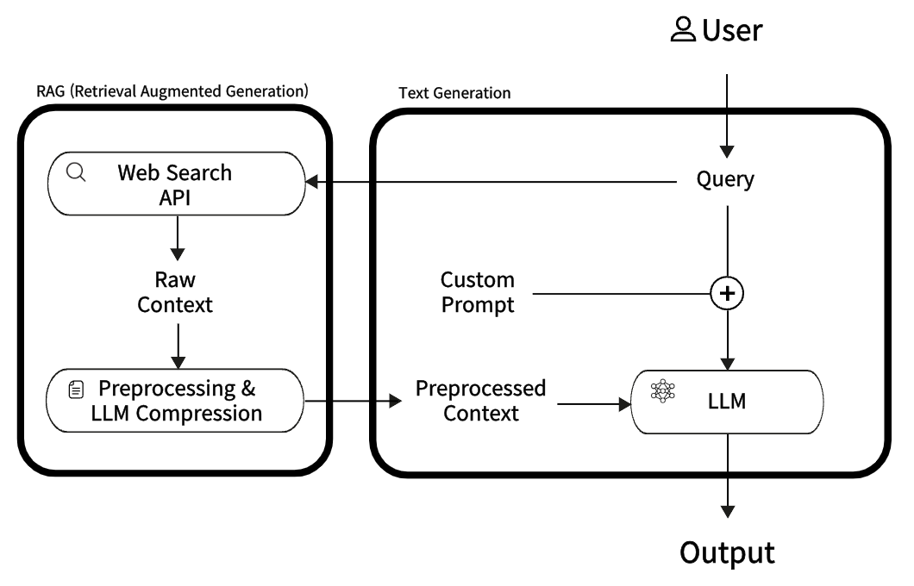

# 📊 Product Comparision & Recommendation

**온라인에서 판매되는 다양한 제품 정보를 비교하고 분석해주는 AI 챗봇 서비스** <br>
사용자가 특정 상품에 대해 질문을 하면, AI 챗봇은 비슷한 제품을 비교분석하고 추천해주는 답변을 제공합니다.

---

## ⚙️ Pipeline

 <br>

사용자로부터 특정 제품에 대해서 비슷한 제품을 비교하고 분석받고 싶다는 요청이 들어오면, RAG 기법을 활용하여 비슷한 제품의 설명을 담고 있는 웹 사이트를 찾은 후 자동으로 크롤링을 진행합니다. <br>

이후 크롤링 된 결과를 전처리하고 LLM을 통해 압축된 중요한 정보가 커스텀 프롬프트와 함께 AI 기반 챗봇에게 전달되면 제품을 분석하여 사용자에게 답변을 제공합니다.

---

## ⚡️ Quick Start

demo 관련 내용 및 코드

---

## ✅ Envirionment Setting

#### 1️. 가상환경 생성

```bash
conda create -n pcr python=3.11
conda activate pcr
```

#### 2️. 필요 라이브러리 설치

```bash
pip install -r requirements.txt
```

---

## 📁 Dataset Construction

```bash
python dataset.py
```
Langchain과 GPT API를 활용하여 자체적으로 질문-정보-답변 데이터셋을 구축합니다.

---

## 🚀 Train & Inference

#### 1️. Train

```bash
python main.py --train=1
```
LoRA 기법을 활용하여 Instruction Tuning을 진행하여 모델이 비교분석 및 추천하는 답변을 더욱 잘 생성하게 만듭니다.

#### 2️. Inference

```bash
python dataset.py --train=0
```

---

## 👥 Contributions

|     이름      |                   김도현                    |              김채린              |               김천지               |               유지혜               |
| :-----------: | :----------------------------------------------: | :----------------------------------: | :----------------------------------------: | :----------------------------------------: |
| **Github ID** | [@Dohyeon-Kim1](https://github.com/Dohyeon-Kim1) | [@KimChaeRin]() | [@CheonjiKim](https://github.com/CheonjiKim) | [@jihyeyu33](https://github.com/jihyeyu33) |

---